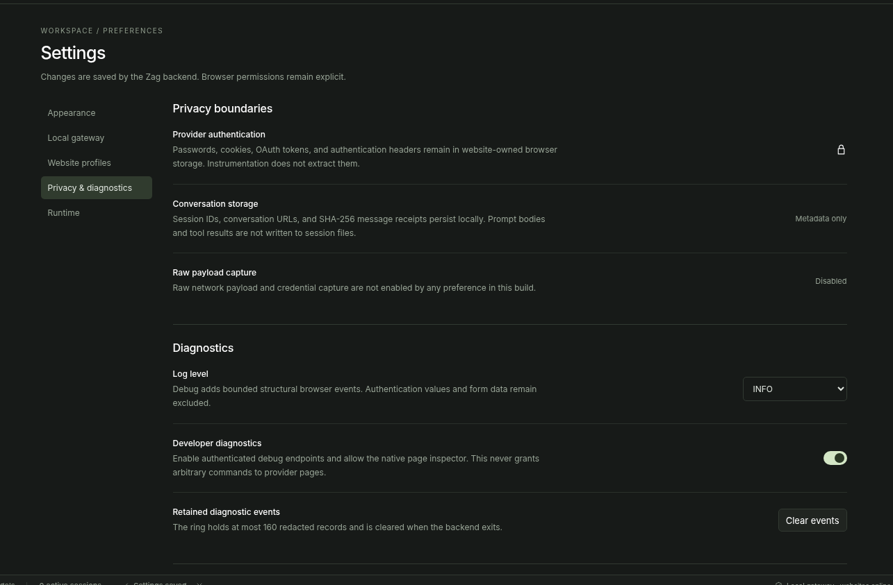
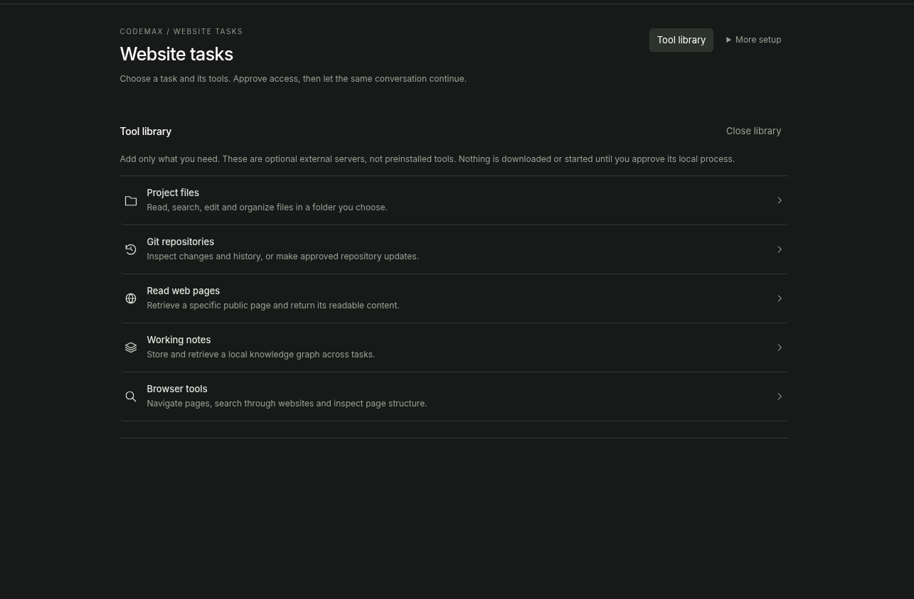

# Codemax

Codemax is a desktop browser that turns AI chat websites you already use into model providers for coding agents.

Open a chat website inside Codemax, sign in normally, and keep using the website quota attached to your account. Codemax observes the page, discovers models and controls, and exposes verified choices to local coding clients.

Provider passwords, cookies, and authentication tokens stay inside the website browser profile.



## How it works

1. Open an AI chat website in Codemax.
2. Sign in through the website itself.
3. Codemax discovers the chat input, model controls, reasoning controls, response surface, and capability evidence that the site actually exposes.
4. Registered providers appear in the left provider shelf.
5. Open Connect, choose your coding client and website model, then copy the local launch command.
6. Your coding agent talks to Codemax locally while Codemax drives the signed in website conversation.

Codemax keeps uncertain capability data unknown. A model name does not become a context limit. A reasoning label does not become a usable mode until the corresponding control has been observed.

## Local tools

Codemax includes native project tools for reading, searching, editing, moving, and deleting files inside a chosen workspace. Trusted commands can also be enabled explicitly.

Tool access is separate from website access. A provider page cannot directly read files or run commands. Local operations require the Codemax permission path and stay scoped to the selected workspace.

Codemax can also connect to external MCP servers when you want additional tools.



## Coding clients

Codemax exposes a local model gateway for compatible clients.

The gateway supports OpenAI chat completions, OpenAI responses, Anthropic messages, and model discovery through one normalized Zag backend.

The repository also includes a Koryphaios provider adapter that reads the private Codemax connection descriptor, refreshes the model catalog, preserves observed reasoning values, and refuses remote gateway redirection.

## Detection

The browser instrumentation watches bounded structural evidence such as interactive controls, selected states, response regions, navigation, and safe network metadata.

Automatic discovery is conservative. It does not treat an ordinary website as an AI provider just because model related text appears on the page.

Authentication and billing actions are outside automatic discovery. Unknown websites can still be inspected through the same generic detector without adding a site specific provider implementation first.

## Architecture

Svelte renders the application interface.

Tauri owns windows, native webviews, process lifecycle, and the narrow desktop bridge.

Zag owns provider discovery, model registry, sessions, protocol translation, routing, permissions, and the local gateway.

The native local tools process handles permission scoped filesystem and command operations.

Remote provider pages stay outside the trusted desktop command surface.

## Build

The current release target is Linux x86_64.

You need Node, npm, Rust, Cargo, Python, pkg config, GTK 3 development files, WebKitGTK 4.1 development files, and the pinned Zag compiler path used by the build scripts.

```bash
npm install
npm run package:linux
```

The Linux bundles are created in the Tauri release bundle directory after every build and test gate succeeds.

## Verification

The native project tool executable is exercised against real temporary files and real child processes. The current suite covers reads, writes, edits, moves, recoverable deletion, traversal refusal, symlink and hardlink refusal, command timeout, cancellation, output limits, protocol negotiation, and capability scoped catalogs.

The Koryphaios adapter is tested against real private connection descriptor files, model catalog parsing, message translation, cancellation, and streaming event framing.

Static checks also verify Tauri capability separation and the Zag module graph.

Full website behavior still depends on the website itself, its current interface, authentication state, quotas, and platform webview behavior.

## Project status

Codemax is under active development. The source tree contains the production browser, detector, Zag gateway, native tools, Tauri host, Svelte interface, Koryphaios integration, tests, and Linux packaging scripts.
